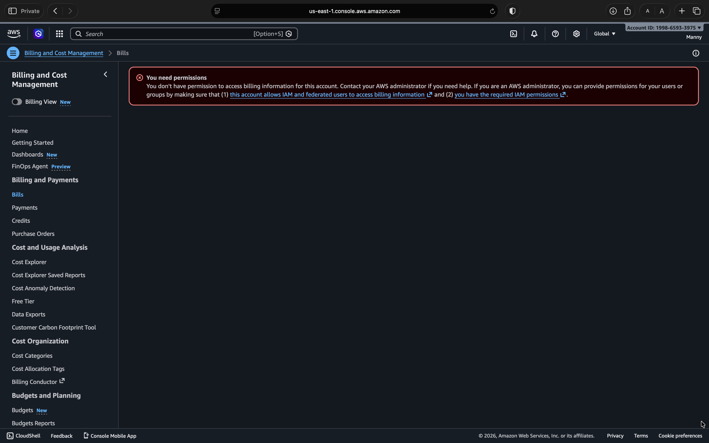
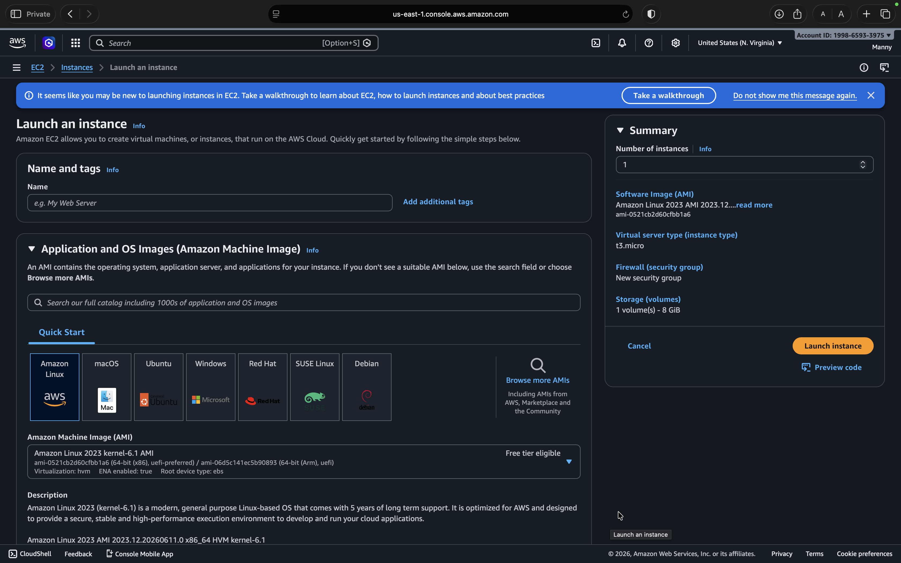
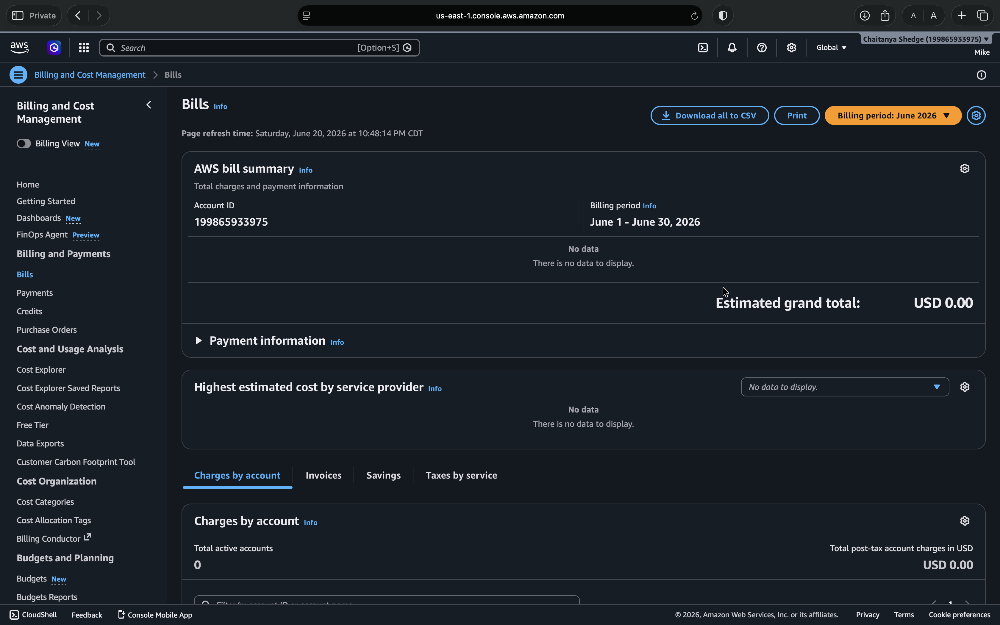
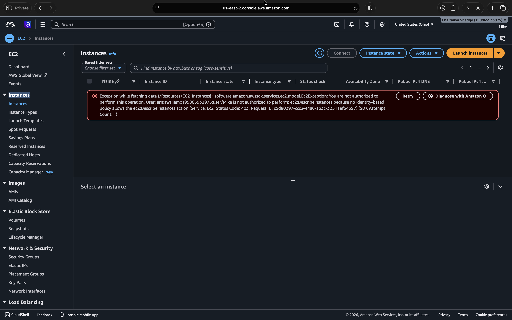
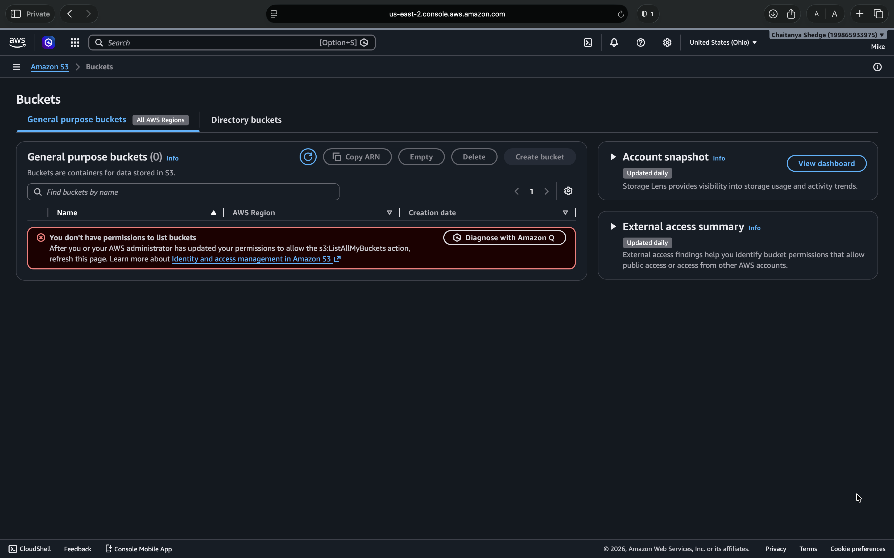
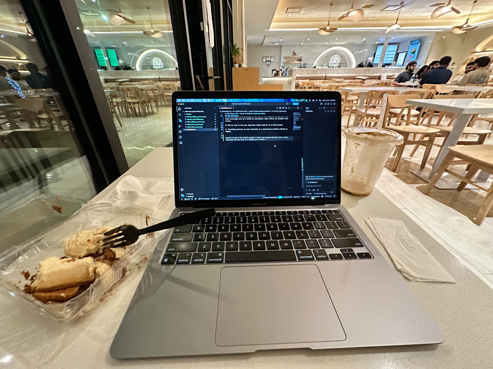

# AWS Cloud IAM – Least Privilege Implementation

In this project, I have implemented the Principle of Least Privilege (PoLP) for a simulated company, TechCorp Enterprises, using AWS IAM. The goal was to make sure each user has exactly the permissions their role requires — nothing more, nothing less.

---

## Overview

Rather than assigning permissions broadly, this project models how a real company should structure IAM from the start. Permissions live on groups, users inherit from groups, and every access decision is intentional.

---

## Architecture

| Type | Identity | Policy | Purpose |
|------|----------|--------|---------|
| Group | Engineering-Group | AmazonEC2FullAccess | Manage EC2 instances |
| Group | Finance-Group | AWSBillingReadOnlyAccess | View billing only |
| User | Manny | via Engineering-Group | Simulated Developer |
| User | Mike | via Finance-Group | Simulated Accountant |

---

## Security Measures

- MFA enforced on the root account.
- Root account is not used for any day-to-day operations.
- All permissions are assigned at the group level, not to individual users.
- No inactive users were left enabled.

---

## Test Results

**Manny (Developer)**

| Resource | Result |
|----------|--------|
| EC2 Access | Success |
| Billing Access | Denied |

**Mike (Accountant)**

| Resource | Result |
|----------|--------|
| Billing Access | Success |
| EC2 Access | Denied |
| S3 Access | Denied |

---

## Screenshots

**Manny – Billing Access Denied**

 

**Manny – EC2 Access**

 

**Mike – Billing Access**

 

**Mike – EC2 Access Denied**

 

**Mike – S3 Access Denied**

---

## Key Takeaways

1. Group-based permissions scale well. Adding a new developer means one group assignment, not a manual policy review.

2. Least privilege helps contain the spread of a compromised account. Manny can't touch billing; Mike can't touch infrastructure — even if either of them is compromised, the attacker is locked to that user's domain and can't move laterally. This directly aligns with the NIST SP 800-61 Containment framework, which identifies limiting the blast radius as a primary response action to stop an active breach from spreading to the rest of the network. In practice, IAM least privilege acts as a built-in containment layer before an incident even occurs.

3. MFA on root is the most important single control in an AWS account.

4. Attaching policies to users directly is a maintenance problem waiting to happen.

Overall it was a fun little project — built and tested entirely from a cafe. Sometimes all you need is a laptop and a coffee !

 
**A good weekend !**

